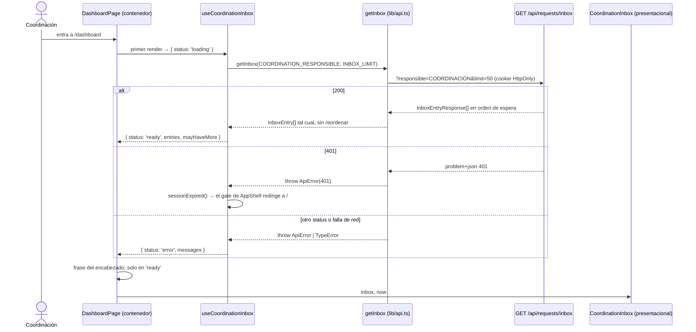
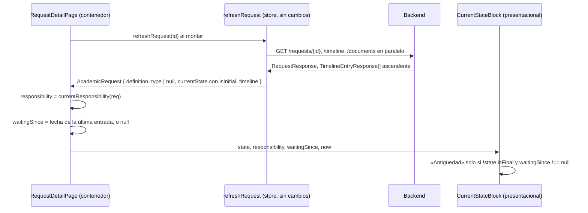

# Design: Bandeja de trabajo de la Coordinación (consumo de la feature 007)

> **Insumos**: `proposal.md` y `exploration.md` (esta carpeta). Contrato
> `Tramita/specs/007-coordination-inbox/contracts/openapi.yaml` (**C**, citado por línea).
> Código leído en esta fase sobre `9bf95a4`; cada cita `archivo:línea` se leyó, y cada conteo
> lleva el comando que lo produjo.
> **Alcance de este documento**: decide el *cómo*. Los requisitos y escenarios los fija
> `sdd-spec` en `specs/`. Donde aquí se sugiere un texto de pantalla, es provisional y manda la
> spec.

## En una línea

La bandeja se carga con un hook propio en `lib/` y se presenta con un componente propio en
`components/dashboard/`, sin tocar el store ni la tabla de búsqueda. El tipo de trámite se
muestra con el nombre que envía el servidor y deja de adivinarse como adición. El stepper se
reemplaza por un bloque presentacional del estado actual. Todo se entrega en siete unidades de
trabajo que dejan `tsc` en verde una por una.

## Decisiones de un vistazo

| # | Pregunta | Elegido | Alternativa de otro eje, descartada | Costo asumido |
|---|---|---|---|---|
| D1 | ¿Dónde viven los datos de la bandeja y cómo conviven con la búsqueda? | Hook `useCoordinationInbox` en `lib/` y componente presentacional `CoordinationInbox` | Estado en `TramitaProvider` (eje datos); fila compartida con la búsqueda (eje composición); `use()` o SWR (eje mecanismo) | Dos tablas de aspecto distinto en la misma pantalla |
| D2 | ¿Cómo se evita que un trámite desconocido se pinte como adición? | Conservar `definition` y mostrar `definition.name`; `type` pasa a `RequestType \| null` | Tercer miembro `'desconocido'` en la unión cerrada (eje forma del dato) | Un ternario binario sobre `type` compila con `null`: el compilador no lo señala |
| D3 | ¿Cómo se migra el reconocimiento del estado inicial? | `State.isInitial` requerido; `isInitialState` lo lee; la tabla queda con devolución y rechazo | Leer `states[]` del catálogo (eje fuente del dato) | Churn de fixtures en 13 archivos, dentro del mismo commit |
| D4 | ¿Cómo se compone el bloque del estado? | `CurrentStateBlock` presentacional en el lugar del stepper; el contenedor deriva responsable y última entrada | El bloque recibe el `AcademicRequest` entero (eje dónde vive la lógica); bloque en la columna derecha (eje ubicación) | La tarjeta «Resumen» queda con una sola fila |
| D5 | ¿Se tipa `WorkflowDefinition.states`? | Se difiere (YAGNI), con una advertencia en `listWorkflowDefinitions` | Tipar ya `WorkflowDefinitionDetail` | El tipo describe un subconjunto de la respuesta de la 007 |
| D6 | ¿En qué orden y con qué garantía? | 7 unidades (C1…C7), cada una verde en lint, `tsc`, tests y build | Un único commit con todo el borrado | Los mismos fixtures se editan en cuatro commits |
| D7 | ¿Cómo se prueba? | Tres capas para la bandeja (cliente, hook, componente) más la página; cada mutante con su test asignado | Probar todo por la página con el store real | Más archivos de test |
| D8 | ¿Dónde vive la etiqueta del responsable? | `COORDINATION_RESPONSIBLE` e `INBOX_LIMIT` en `lib/use-coordination-inbox.ts` | Variable de entorno (eje fuente); `lib/api.ts` (eje módulo) | Si aparece un segundo consumidor, la constante se muda |

## Technical Approach

**Principio**, heredado de la propuesta: el servidor decide y el cliente presenta. El orden, el
instante de la espera, el origen, el nombre del trámite y la marca de inicial llegan como datos,
y el cliente no los recalcula.

Cómo se traduce a la estructura del App Router (`openspec/config.yaml`, `rules.design`):

| Capa | Qué agrega o cambia esta change |
|---|---|
| `lib/` — datos y dominio | `getInbox` y sus tipos (`lib/api.ts`, `lib/types.ts`); un hook de carga (`lib/use-coordination-inbox.ts`); `isInitialState` lee el contrato y `currentResponsibility` se muda a `lib/request-state.ts` |
| `components/` — UI compartida | Dos presentacionales nuevos (`CoordinationInbox`, `CurrentStateBlock`); `TypeBadge` pasa a recibir el código y el nombre de la definición; se borra `WorkflowStepper` |
| `app/` — rutas (contenedores) | El tablero llama al hook y reparte su valor; el detalle deriva responsable y última entrada; se borra `app/settings/` |
| `lib/store.tsx` | **Solo quita**: vencimiento, etapa y `workflowConfig`. Recibe `isInitial` y `definition` porque es donde se mapea la respuesta a `AcademicRequest`, pero **nada de la bandeja** (decisión 12) |

**Qué no cambia**, para que el revisor no lo busque:

- La búsqueda: `searchRequests`, `requests`, `searched` y `searchErrors` (`lib/store.tsx:302-328`)
  quedan intactos, y sus tests existentes siguen pasando sin tocar su intención.
- `parseServerDateTime` y `HAS_OFFSET` (`lib/format.ts:8-17`).
- `assignedTo` y el filtro «Responsable» del tablero (`lib/store.tsx:211`,
  `app/dashboard/page.tsx:104`), fuera de alcance.
- `lib/use-request-detail.ts` sigue sin consumidor. El detalle sigue cargando por
  `refreshRequest`; unificarlo es el `#10`.
- Las tarjetas de resumen siguen contando la búsqueda (`#36`).

## Architecture Decisions

### D1 — Fork F: la bandeja en un hook propio y un presentacional propio

**Elegí** un hook `useCoordinationInbox()` en `lib/use-coordination-inbox.ts` que carga con
`useEffect` y flag `ignore` y guarda su estado local como unión discriminada, más un componente
presentacional `CoordinationInbox` en `components/dashboard/coordination-inbox.tsx`. Los elegí
**frente a** guardar la bandeja en `TramitaProvider` y ensanchar la fila de `RequestsTable`,
**sabiendo que** el tablero mostrará dos tablas de aspecto distinto: la de la bandeja y la de los
resultados de búsqueda.

**Alternativas exploradas, en tres ejes distintos:**

| Eje | Alternativa | Por qué se descarta |
|---|---|---|
| Datos | Estado de la bandeja en `TramitaProvider`, junto a `requests` | Tensiona la decisión 12 y agranda el store que el `#10` quiere achicar. Obliga a invalidar tras `transition()` (`lib/store.tsx:446-474`). Con el hook, volver al tablero después de registrar una transición vuelve a consultar sin código de invalidación. Además, los cuatro tests que mockean `@/lib/store` entero tendrían que conocer un campo nuevo |
| Composición | Un modelo de fila compartido (`RequestListItem`) renderizado por una `RequestsTable` generalizada | Los esquemas son disjuntos: `InboxEntry` no trae `studentDocument` y trae `waitingSince`, `origin` y `pendingResponsible` (C:196-261). Una fila común ramifica por presencia de campo, que es el defecto que señala la regla 3 de `revisar-frontend-next`. Y la tabla de búsqueda imprime «C.C. {cédula}» (`components/dashboard/requests-table.tsx:105`): compartir la fila acerca el documento a una lista cuyo invariante es no tenerlo (C:64-66) |
| Mecanismo | `use()` de React o SWR | La guía local de Next.js ofrece esas dos vías para Client Components (`node_modules/next/dist/docs/01-app/01-getting-started/06-fetching-data.md:232-237`), pero `use()` espera una promesa creada en un Server Component (`:241`) y esta app se autentica con la cookie del navegador desde Client Components. SWR suma una dependencia y una semántica de caché que nadie pidió. El repo ya tiene el patrón `useEffect` + `ignore` escrito y probado (`lib/use-request-detail.ts:36-72`) |

**Sub-decisiones:**

- **Contenedor único.** `app/dashboard/page.tsx` llama al hook **una vez** y reparte el mismo
  valor a la frase del encabezado (P3) y a la sección de la bandeja. Hay una sola fuente del
  conteo.
- **Ubicación en la página.** El orden queda: encabezado → **sección de la bandeja** → tarjetas de
  resumen → indicadores → filtros → búsqueda. Las tarjetas, los indicadores y los filtros siguen
  actuando solo sobre los resultados de búsqueda, como hoy. La bandeja no se filtra ni se reordena
  en el cliente: el conjunto y el orden son del servidor (decisión 3).
- **Estado como unión discriminada** `loading | ready | error`, en lugar de los booleanos de
  `use-request-detail.ts`. La regla 3 (`null` ≠ `[]`) queda resuelta por construcción:
  `ready` con `entries: []` es la bandeja vacía legítima (C:97-101); `loading` es «todavía no se
  sabe». El checklist de TypeScript de `revisar-frontend-next` pide uniones discriminadas cuando
  hay tres casos o más.
- **«Puede haber más».** `mayHaveMore` se calcula en el hook, que es quien conoce el `limit` que
  viajó: `entries.length >= INBOX_LIMIT`. Es idéntico a `===` para toda respuesta válida, porque
  el servidor nunca devuelve más que `limit` (C:84-95), y no calla un exceso.
- **401.** El hook llama a `useAuth().sessionExpired()` (`lib/auth-store.tsx:88-91`) y no produce
  mensaje. El gate de `AppShell` (`components/app-shell.tsx:46-50`) redirige. **No** se usa el
  evento `tramita:session-expired`: el store lo escucha (`lib/store.tsx:340`), pero nadie lo
  despacha (`rg -n 'session-expired' app components lib` → solo `addEventListener` y
  `removeEventListener`).
- **Sin compuerta de autenticación en el hook.** El hook corre aunque `AppShell` todavía no
  muestre nada (`components/app-shell.tsx:143`). La petición lleva la cookie `HttpOnly`, así que
  con sesión válida responde 200. Sin sesión, responde 401 y `sessionExpired()` coincide con lo
  que `getMe` concluirá.
- **Un solo árbol DOM.** `CoordinationInbox` renderiza una única `<table>` con desplazamiento
  horizontal en móvil, no la pareja tabla + tarjetas de `RequestsTable`
  (`components/dashboard/requests-table.tsx:68,131`). El orden se prueba sobre un único árbol y
  el lector de pantalla no depende de clases CSS. El costo: en móvil se desplaza en lugar de
  apilar tarjetas.
- **Filas navegables por teclado.** El nombre del estudiante es un `<Link>` a `/requests/{id}`.
  No se copia el `onClick` sobre `<tr>` de la tabla de búsqueda (checklist de accesibilidad).
- **Columnas.** Estudiante (enlace) · Trámite (`TypeBadge` con `definition.code` y `definition.name`) · Estado
  (`currentState.name`) · Esperando (desde `waitingSince`) · Origen. No se muestra
  `pendingResponsible`: es el mismo valor en todas las filas y el título de la sección ya lo dice
  (C:242-246). Tampoco se muestra `createdAt`, que no está en el alcance y convive mal con la
  espera en la misma fila.

### D2 — Fork E: mostrar lo que envía el servidor y dejar de adivinar

**Elegí** combinar dos cosas. Primero, conservar `definition` en `AcademicRequest` y mostrar
`definition.name` en **todo** lugar donde se muestra el tipo. Segundo, convertir `typeFromCode` en
una allowlist que devuelve `RequestType | null`, de modo que las ramas que dependen del tipo
traten una definición desconocida como «no reconocida» y no como adición. Lo elegí **frente a**
agregar un tercer miembro `'desconocido'` a la unión cerrada, **sabiendo que** un ternario binario
como `type === 'novedad_notas' ? … : …` compila igual con `null` y cae en la rama de adición. El
compilador no los encuentra: los tres que existen se convierten aquí y un test fija cada uno.

**Dónde se muestra el tipo hoy**, medido con
`rg -n "RequestType\b|REQUEST_TYPE_LABELS|TypeBadge|\.type ===" app components lib`:

| Sitio | Hoy | Después |
|---|---|---|
| `TypeBadge` (`components/type-badge.tsx:6-14`), usado en `components/dashboard/requests-table.tsx:110,152` y `app/requests/[id]/page.tsx:288` | `REQUEST_TYPE_LABELS[type]` + ícono por tipo | `TypeBadge({ name })`: `definition.name` + un ícono neutro |
| Fila «Tipo de trámite» del detalle (`app/requests/[id]/page.tsx:598-601`) | `REQUEST_TYPE_LABELS[req.type]` | `req.definition.name` |
| **PDF**, título y fila (`components/pdf-document.tsx:49,74`) — la propuesta no lo listaba | `REQUEST_TYPE_LABELS[request.type]` | `request.definition.name` |
| **PDF**, párrafo de detalle (`components/pdf-document.tsx:10,88-112`) | `isNotas ? notas : «Se solicita la adición de N créditos»` | Tres vías: notas / créditos / sin párrafo |
| Columnas de asignaturas del detalle (`app/requests/[id]/page.tsx:378-388,399-413`) | `novedad ? Actual/Propuesta : Créditos/Grupo` | Tres vías: notas / créditos / solo Código y Asignatura |
| Filtro «Tipo de trámite» del tablero (`app/dashboard/page.tsx:63,216`) | `r.type !== typeFilter` | Sin cambio de código: con `type: null`, la fila no aparece bajo ningún tipo concreto y sí bajo «Todos» |
| `STATE_SEMANTICS` (`lib/request-state.ts:50-66`) | La fila de adición se aplicaba a lo desconocido | `semanticsOf` devuelve `SIN_SEMANTICA` cuando `type` es `null` |

**Alternativas exploradas, en ejes distintos:**

| Eje | Alternativa | Por qué se descarta |
|---|---|---|
| Forma del dato | Tercer miembro `'desconocido'` en `RequestType`, con filas en cada `Record` | Obliga a inventar filas: `REQUEST_TYPE_LABELS` ofrecería «Desconocido» como opción del filtro (`app/dashboard/page.tsx:216`) y `STATE_SEMANTICS` una fila vacía. `NewRequestInput.type` y `typeToCode` (`lib/store.tsx:34,130`) aceptarían un tipo que no se puede crear, y hace falta una segunda unión para impedirlo. Y seguiría mostrando un rótulo genérico en lugar del nombre que el servidor ya envía |
| Flujo del dato, sin tocar la clasificación | Mostrar `definition.name`, pero dejar el default de `typeFromCode` | La mentira se muda del rótulo al comportamiento: el filtro, el párrafo del PDF y las columnas seguirían tratando lo desconocido como adición. El mutante 4 sobrevive |
| Eliminar `type` | Ramificar por `definition.code` en cada componente | Esparce códigos del motor por `app/` y `components/`: rompe la regla 1 de `revisar-frontend-next` y su verificación con `rg` |

**Sub-decisiones:**

- **Precedente de dato crudo.** `definition: WorkflowDefinition` se agrega igual que se agregó
  `currentState` en la change archivada: conservar el dato en lugar de descartarlo
  (`openspec/changes/archive/2026-09-19-semantica-de-estado-del-tramite/design.md`, Decisión 3).
  El requisito vigente «El detalle muestra los datos de identificación» ya pide
  `definition.name` (`openspec/specs/workflow-requests/spec.md:203-207`).
- **`TypeBadge` conserva un ícono por trámite conocido, con respaldo neutro.** Recibe
  `definition.code` y `definition.name`: el rótulo es siempre el nombre que envía el servidor, y el
  ícono sale de un mapa decorativo por código (`ADICION_CREDITOS` → birrete, `NOVEDAD_NOTAS` →
  libro) con un ícono neutro para cualquier otro código. El mapa no decide nada: un código
  desconocido muestra su nombre real y el ícono neutro, así que no reabre el #9(b). La bandeja,
  que no tiene `type` derivado, lo usa igual que la tabla de búsqueda.
  **Alternativa descartada** (2026-09-22, decisión del responsable del proyecto sobre el diseño
  validado): un solo ícono neutro con `TypeBadge({ name })`, que evita nombrar códigos en el
  cliente al costo de perder la distinción visual en una tabla que la Coordinación mira todo el
  día. **Costo de lo elegido**: el cliente conoce dos códigos solo para decorar; un trámite
  configurado mañana se ve con el ícono neutro hasta que alguien agregue su entrada, sin que nada
  más cambie.
- **Cambio visible de mayúsculas.** El seed del backend nombra `Adición de créditos` y
  `Novedad de notas` (`Tramita/src/main/resources/db/migration/V2.1.0__Seed_workflow_definitions.sql:22,63`),
  mientras que `REQUEST_TYPE_LABELS` dice `Adición de Créditos` (`lib/ui-constants.ts:8`). Las
  pantallas pasan a la forma del servidor. Dos tests afirman el literal viejo y se actualizan:
  `app/dashboard/page.test.tsx:172` y `app/requests/[id]/documento/page.test.tsx:73`.
  `REQUEST_TYPE_LABELS` se conserva para las opciones del filtro y para el formulario de alta,
  que está fuera de alcance.
- **El reconocimiento de códigos sigue en un solo lugar.** `typeFromCode` y `typeToCode` ya eran
  el único sitio del cliente con `ADICION_CREDITOS` y `NOVEDAD_NOTAS` (`lib/store.tsx:129-130`);
  la allowlist no agrega sitios.

### D3 — `isInitial`: se lee del contrato, la tabla conserva dos tercios

**Elegí** hacer `isInitial: boolean` **requerido** en `State` (`lib/types.ts:18-22`) y en `ApiState`
(`lib/store.tsx:48`), porque C:289 lo declara requerido. `isInitialState` devuelve
`request.currentState.isInitial`, `StateSemantics` pierde `initial` y `STATE_SEMANTICS` conserva
solo `DEVUELTA` y `RECHAZADA` de adición. Lo elegí **frente a** leer `states[]` del catálogo de
`/workflow-definitions`, **sabiendo que** el churn de fixtures rompe `tsc` en 13 archivos hasta
que todos se actualizan, así que todo va en el mismo commit.

**Alternativas:**

- *Eje fuente del dato*: buscar el estado actual en `states[]` del catálogo por código. Exige
  cargar el catálogo antes de que funcione cualquier predicado, crea una segunda fuente para un
  dato que ya viaja en cada `currentState` (C:284-306) y choca con D5. Se descarta.
- *Mismo eje, variante débil*: `isInitial?: boolean` con la tabla por código como respaldo.
  Mantiene viva la deuda, y un campo ausente usaría en silencio la regla vieja. El contrato lo
  declara requerido. Se descarta.

**Reescritura del comentario de deuda** (`lib/request-state.ts:1-15`, en particular `:8-12`). Qué
debe decir, no su redacción final:

1. La 007 expone `isInitial` (C:295-301). Se pagó **el tercio del inicio**: el cliente ya no
   reconoce `EN_COORDINACION` ni `REGISTRADA`.
2. Quedan dos tercios en la tabla, devolución y rechazo, porque el motor no los modela como
   propiedades del estado y no habrá `isSuccess` (decisión 4). No se abre issue desde el front.
3. Las líneas `:3-6`, que dicen que `State` solo trae `code`, `name` e `isFinal`, pasan a
   nombrar también `isInitial`. El comentario de `:42-49` deja de mencionar el renombre del
   inicial de V3.2.0, que ya no espeja.

**Plan de churn de fixtures.** `rg -c 'isFinal' app components lib` → 55 coincidencias en 17
archivos; incluye producción y comentarios, así que es una cota, no la cuenta exacta de literales.

| Archivo | Cómo se actualiza |
|---|---|
| `lib/request-state.test.ts` | Los helpers `adicion`/`novedad` (`:15-23`) pasan a recibir `{ isFinal, isInitial }`; `ADICION_STATES` y `NOVEDAD_STATES` marcan `EN_COORDINACION` y `REGISTRADA` como iniciales |
| `lib/store.test.ts` | `summary` y `withState` (`:9-21`) ganan `isInitial`; la aserción `toEqual` de `:31-35` lo incluye |
| `components/dashboard/requests-table.test.tsx`, `components/dashboard/summary-cards.test.tsx`, `components/app-shell.test.tsx` | Sus helpers `conEstado`/`urgente` agregan `isInitial: false` |
| `app/dashboard/page.test.tsx`, `app/requests/[id]/page.test.tsx`, `app/requests/[id]/documento/page.test.tsx` | Literales tipados `AcademicRequest` y `availableTransitions[].targetState` |
| `lib/api.test.ts`, `lib/use-request-detail.test.ts` | Literales tipados `Request`, `RequestSummary`, `TimelineEntry` |
| `lib/fixtures/mock-requests.ts` | Los seis `currentState` |
| `app/dashboard/page.integration.test.tsx` | `MATCH` no está tipado y `tsc` no lo exige, pero se agrega `isInitial: true` porque el backend lo envía y, sin él, `status` deja de ser `pendiente` |

### D4 — Bloque del estado actual: presentacional en el lugar del stepper

**Elegí** un componente presentacional `CurrentStateBlock` en `components/current-state-block.tsx`,
plano como los demás componentes del detalle (`workflow-timeline.tsx`, `action-dialog.tsx`). Ocupa
el lugar de la tarjeta del stepper (`app/requests/[id]/page.tsx:318-330`). El contenedor, que es
la página, **deriva** el responsable y la última entrada; el bloque **presenta**. Lo elegí
**frente a** que el bloque reciba el `AcademicRequest` entero, **sabiendo que** el contenedor gana
unas líneas de derivación.

**Composición del bloque:**

| Pieza | Fuente | Regla |
|---|---|---|
| Nombre del estado | `state.name` | Siempre |
| Marcas | `state.isInitial`, `state.isFinal` | Una insignia por marca verdadera. Nunca «paso N de M», nunca una línea ni una lista de estados (FR-011b, C:133-136) |
| «Ahora depende de» | `responsibility` (`currentResponsibility`) | `single` → el responsable; `varies` → «Depende de la acción que se registre»; `closed` → «Trámite cerrado» |
| «Antigüedad del estado» | `waitingSince` y `now` → `daysSince` (`lib/format.ts:20-24`) | «Lleva N días», con el singular resuelto. Oculta si `state.isFinal` o si `waitingSince` es `null` |

La raíz es `<section aria-labelledby>` con el encabezado «Estado actual». Así los tests acotan con
`within(screen.getByRole('region', { name: /estado actual/i }))` (convención 3).

**Qué deriva el contenedor, y por qué ahí:**

- `responsibility = currentResponsibility(req)`.
- `waitingSince` = `date` de la **última** entrada de `req.timeline` (índice `length − 1`), o
  `null` si el timeline está vacío. `AcademicRequest.timeline` es `TimelineEvent[]`, con
  `date = occurredAt` (`lib/store.tsx:227`), en el orden ascendente que devuelve el backend
  (`lib/api.ts:328`; `openspec/specs/request-timeline/spec.md:16-27`). Con timeline vacío **no**
  se cae a `createdAt`: eso es exactamente el mutante P1/P2 y contradice la decisión 6.
- `now` = `useState(() => Date.now())` al tope de la página, el mismo patrón que el tablero
  (`app/dashboard/page.tsx:28`). Mantiene puro el render y deja `now` inyectable en el test del
  componente.

Separar así pone cada riesgo en su capa de test. La **fuente** de la espera (última entrada, no
`createdAt`) se prueba en la página. Las **permutaciones de presentación** (marcas, tres casos de
responsable, singular y plural, oculto al cerrar) se prueban baratas en el componente.

**`currentResponsibility` se muda** de `app/requests/[id]/page.tsx:53-56,67-73` a
`lib/request-state.ts`, con su tipo `Responsibility`. Motivos: responde una pregunta sobre el
estado, como los demás predicados de ese módulo; así se prueba sin montar la página; y deja de ser
un export con nombre de un archivo de ruta. Su parámetro pasa a un tipo estructural
`{ currentState: State; availableTransitions?: AvailableTransition[] }`, porque
`AcademicRequest.availableTransitions` es opcional (`lib/types.ts:171`) y hoy no encaja con
`Request`. El comportamiento no cambia.

**Alternativas exploradas, en ejes distintos:**

| Eje | Alternativa | Por qué se descarta |
|---|---|---|
| Dónde vive la lógica | El bloque recibe `request: AcademicRequest` y deriva todo adentro | Acopla un presentacional al modelo del store, obliga al test del componente a construir fixtures completos y mezcla en una capa el mutante de fuente con los de presentación |
| Ubicación en pantalla | El bloque reemplaza la tarjeta «Resumen» de la columna derecha | «De quién depende ahora» es el dato central de la pantalla (`CLAUDE.md`, «Qué se está construyendo»). El lugar prominente del stepper es el que le corresponde |

**La tarjeta «Resumen»** (`app/requests/[id]/page.tsx:592-617`) pierde «Vencimiento» (ítem 3) y
«Asignado a» (P2), y conserva «Tipo de trámite» con `definition.name`. Queda con una sola fila, que
repite la insignia del encabezado. Se conserva igual: es el cambio mínimo, y la fila está nombrada
en la cota del #9(b). Quitarla se registra como pregunta abierta, no bloqueante.

`assignedTo` sigue en el modelo porque lo usa el filtro «Responsable» del tablero; solo se retira
de la pantalla del detalle (P2).

### D5 — `WorkflowDefinition.states`: se difiere

**Elegí** no tipar `states` en esta change y dejar un comentario de tres líneas en
`listWorkflowDefinitions` (`lib/api.ts:220-225`). Lo elegí **frente a** crear ya
`WorkflowDefinitionDetail`, **sabiendo que** el tipo de retorno describe un subconjunto de lo que
envía la 007. En TypeScript, eso es inocuo: el campo extra se ignora y el tipo no afirma nada
falso.

- **Por qué diferir**: nada en esta change lee `states[]`, porque el inicio sale de
  `currentState.isInitial` (D3). Además, `listWorkflowDefinitions` no tiene consumidor de
  producción: `rg -n 'listWorkflowDefinitions' app components lib` → solo su definición y
  `lib/api.test.ts`. El store consultaba el catálogo con `apiFetch` directo (`lib/store.tsx:347`),
  y ese efecto se va con `workflowConfig` en C5.
- **Qué dice el comentario**: la 007 agrega `states` (`WorkflowDefinitionDetailResponse`,
  C:263-282), y **no** debe agregarse a `WorkflowDefinition`, que también tipa la definición
  anidada en `Request`, `RequestSummary` e `InboxEntry`, donde el backend no la envía (C:308-317).
  Es la trampa que la propuesta detectó en el plan («Acotación al plan»).
- **Cuándo se revisa**: el día que una pantalla necesite los estados, con su propio tipo.

### D6 — Secuencia: siete unidades, cada una verde

**Elegí** siete unidades de trabajo en orden de dependencia, cada una con `pnpm lint`,
`rm -rf .next && pnpm exec tsc --noEmit`, `pnpm test` y `pnpm build` en verde. Lo elegí **frente
a** un único commit con todo el borrado, **sabiendo que** los mismos fixtures se editan en cuatro
commits distintos (C1 a C4), una línea cada vez.

```text
C1 vencimiento (ítem 3) ─────────────── independiente
C2 isInitial (ítem 5) ─┬─> C3 tipo honesto (#9 b) ─> C4 bloque del estado (#9 a, P1, P2) ─> C5 Configuración (ítem 6)
                       └─> C6 cliente + hook (ítem 1) ─> C7 tablero (ítem 2, P3)
C7 usa TypeBadge({ code, name }) de C3: dependencia blanda.
```

| Unidad | Qué | Depende de | Por qué ese orden |
|---|---|---|---|
| C1 | Baja del vencimiento y de sus helpers | — | Primero, porque quita `dueDate` de los fixtures antes de que las demás unidades los toquen |
| C2 | `State.isInitial` + `isInitialState` + churn de fixtures | — | `InboxEntry.currentState` es un `State` (C6) |
| C3 | `definition` + `type: RequestType \| null` + `TypeBadge` + PDF | C2 (fixtures) | Toca las mismas líneas del detalle que C4 |
| C4 | Bloque del estado; baja del stepper, de `stageFromState` y de `currentStage`; mudanza de `currentResponsibility` | C2, C3 | Quita la lectura de `workflowConfig` del detalle (`app/requests/[id]/page.tsx:87,115-118`) |
| C5 | Baja de Configuración y de `workflowConfig` | C4 | Antes de C4, el detalle todavía lee `workflowConfig` y `tsc` rompe |
| C6 | `getInbox`, `InboxEntry`, hook y constantes | C2 | Sin UI: aditivo |
| C7 | Sección de la bandeja, frase del encabezado, stub de integración | C6 (y C3 para `TypeBadge`) | El stub se endurece **antes** de conectar la carga |

**Trampas que cada unidad debe respetar:**

- **Verde en `pnpm test`, rojo en `tsc`.** `app/settings/page.tsx` no tiene test, y los campos
  requeridos nuevos (`isInitial`, `definition`) rompen fixtures solo al compilar. Vitest no
  verifica tipos. Cada unidad corre `tsc`, no solo la última.
- **`TS2307` falso al borrar una ruta** (C5). Corresponde a los tipos obsoletos de `.next/`. Hay
  que parar `pnpm dev` y correr `rm -rf .next` antes de `tsc`. Un `TS2307` cuya ruta empieza con
  `.next/` nunca es del código (`revisar-frontend-next`, «Trampas del entorno»).
- **Helpers muertos.** `addBusinessDays`, `businessDaysUntil` e `isOverdue` (`lib/format.ts:46-67`)
  se van en C1 con su `describe` (`lib/format.test.ts:99-117`). `rg -n
  'addBusinessDays|businessDaysUntil|isOverdue' app components lib` debe dar 0 al cerrar C1.
- **Sobre `pnpm lint`.** `revisar-frontend-next` dice que está roto; `openspec/config.yaml`
  registra salida 0 el 2026-09-16. Se corre y se reporta. La afirmación del skill parece
  desactualizada (confianza media: no se re-midió en esta fase).

### D7 — Estrategia de test (resumen; detalle en *Testing Strategy*)

**Elegí** probar la bandeja en tres capas, más la página:

1. el cliente (`lib/api.test.ts`), con la forma de la URL y los errores;
2. el hook (`lib/use-coordination-inbox.test.ts`), con carga, orden, `mayHaveMore`, vacío, error
   y 401;
3. el componente (`components/dashboard/coordination-inbox.test.tsx`), con presentación, orden,
   espera, origen, aviso y ausencias;
4. la página, con el cableado.

Lo elegí **frente a** probar todo por la página con el store real, **sabiendo que** son más
archivos de test. La ventaja: cada mutante obligatorio tiene un test asignado que falla por la
razón correcta, y ningún test depende de `waitFor` para afirmar presentación.

### D8 — La constante del responsable

**Elegí** declarar `COORDINATION_RESPONSIBLE = 'COORDINACION'` e `INBOX_LIMIT = 50` en
`lib/use-coordination-inbox.ts`. Lo elegí **frente a** `lib/api.ts` y a una variable de entorno,
**sabiendo que** si aparece un segundo consumidor de la etiqueta, la constante se muda a un módulo
propio.

- **Por qué ahí.** Es el único consumidor, y la constante documenta *por qué* la consulta pide esa
  etiqueta junto a la consulta misma. `lib/api.ts` sigue siendo espejo del contrato:
  `getInbox(responsible, limit)` es genérico porque el servidor, a propósito, no conoce nombres de
  áreas (C:74-78). `lib/ui-constants.ts` guarda rótulos de UI, y `COORDINACION` no es un rótulo
  sino el valor de un parámetro.
- **`INBOX_LIMIT` también ahí, no en `lib/api.ts`.** La tabla de la propuesta lo ubicaba en
  `lib/api.ts`. El contrato dice que «quien llama debe decidir cuánto pide» (C:92-95), y quien
  llama es el hook. Por eso `limit` es **requerido** en la firma de `getInbox`: el compilador
  garantiza que siempre viaje explícito, que es lo que pide el *Approach* de la propuesta.
- **Eje fuente, descartado.** Una variable `NEXT_PUBLIC_…` permitiría desplegar la cabina para
  otra área sin tocar código. Pero suma configuración de despliegue y un modo de fallo (variable
  ausente) para un caso que no existe. La decisión 11 ya trata la constante como excepción
  consciente. Tomarla de la sesión está excluido por esa misma decisión.
- **Verificación**: `rg -n "'COORDINACION'" app components lib -g '!*.test.*'` → 1.

## Data Flow

### Entrar al tablero → cargar la bandeja → render



La búsqueda no cambia: el submit del formulario llama a `searchRequests` del store, que puebla
`requests` y `searched` (`app/dashboard/page.tsx:284-289`, `lib/store.tsx:302-328`). El hook y la
búsqueda no comparten estado, así que ninguna pisa a la otra.

### Abrir el detalle → bloque del estado



### Zonas horarias

| DTO | Formato | Cómo se lee |
|---|---|---|
| `InboxEntryResponse.createdAt` y `.waitingSince` | Con offset de la sede, `-05:00` (C:212-241) | `parseServerDateTime` respeta el offset (`HAS_OFFSET`, `lib/format.ts:8,15-17`) |
| `RequestResponse`, `RequestSummaryResponse`, `TimelineEntryResponse` | UTC sin marcador (`Tramita#36`) | `parseServerDateTime` los lee como UTC |

No se escribe código de fechas nuevo: la espera y la antigüedad salen de `daysSince`
(`lib/format.ts:20-24`), que ya pasa por `parseServerDateTime`. El código nuevo **no** copia el
`new Date(r.createdAt)` preexistente del tablero (`app/dashboard/page.tsx:68,114`), que queda
fuera de alcance. La PR declara la mezcla de formatos (decisión 8) para que no se lea como una
inconsistencia nueva.

### Errores

| Caso | Dónde se decide | Qué se ve |
|---|---|---|
| 200 con `[]` | Hook → `ready` con `entries: []` | Estado vacío explicado, no un error (C:97-101; regla 7) |
| 401 | Hook → `sessionExpired()` | Nada: el gate reemplaza la pantalla (regla 5) |
| 400 | Hook → `apiErrorMessages(err, { badRequest })` (`lib/api-errors.ts:16-44`) | Un mensaje propio de la bandeja. El genérico, «Revise los datos ingresados», no aplica: el usuario no ingresó nada, porque `responsible` y `limit` son constantes |
| 5xx u otro | Hook → `apiErrorMessages(err)`, **sin** `fallback`, para que llegue el `title` del servidor, igual que en la búsqueda (`lib/store.tsx:320-326`) | Mensajes con `role="alert"` dentro de la sección. La búsqueda sigue usable |
| Falla de red | `apiErrorMessages` → «Sin conexión con el servidor…» | Igual que el caso anterior |

No se agrega botón de reintento (YAGNI): recargar la página vuelve a consultar.

## File Changes

| Archivo | Acción | Unidad | Qué y por qué |
|---|---|---|---|
| `lib/format.ts` | Modify | C1 | Borra `addBusinessDays`, `businessDaysUntil` e `isOverdue` (`:46-67`). `HAS_OFFSET`, `parseServerDateTime` y `daysSince` quedan intactos |
| `lib/format.test.ts` | Modify | C1 | Borra el `describe('isOverdue')` (`:99-117`) y su import |
| `lib/store.tsx` | Modify | C1–C5 | C1: borra el import `:17`, `deriveDueDate` `:154-157` y `dueDate` en `:196,472`. C2: `ApiState` gana `isInitial` (`:48`). C3: allowlist en `typeFromCode` (`:129`), `baseRequest` gana `definition` y `statusFromState` acepta `null`. C4: borra `stageFromState` (`:147-152`) y `currentStage` (`:210`). C5: borra `workflowConfig` completo (`:18,27,112,121,290,344-360,476,493,502-503`) |
| `lib/types.ts` | Modify | C1–C6 | C1: sin `dueDate` (`:158`). C2: `State.isInitial`. C3: `AcademicRequest.definition` y `type: RequestType \| null`. C4: sin `currentStage` (`:169`) ni `WorkflowStageConfig` (`:183-187`). C5: sin `RequestTypeConfig` (`:118-124`). C6: agrega `InboxEntry` e `InboxOrigin` |
| `lib/request-state.ts` | Modify | C2–C4 | C2: `isInitialState` lee el campo, la tabla pierde `initial` y se reescribe el comentario. C3: `StatefulRequest.type` admite `null` y `semanticsOf` lo resguarda. C4: recibe `Responsibility` y `currentResponsibility` |
| `lib/request-state.test.ts` | Modify | C2–C4 | Ver *Testing Strategy* |
| `lib/store.test.ts` | Modify | C2–C4 | Ver *Testing Strategy* |
| `lib/api.ts` | Modify | C6 | Agrega `getInbox`. Comentario de D5 en `listWorkflowDefinitions` |
| `lib/api.test.ts` | Modify | C2, C6 | Fixtures con `isInitial`; `describe('getInbox')` |
| `lib/use-coordination-inbox.ts` | Create | C6 | Hook, constantes y `InboxState` |
| `lib/use-coordination-inbox.test.ts` | Create | C6 | `renderHook` + stub de `fetch`, con el patrón de `lib/use-request-detail.test.ts` |
| `lib/use-request-detail.test.ts` | Modify | C2 | Fixtures con `isInitial` |
| `lib/ui-constants.ts` | Modify | C5, C7 | C5: borra `workflowConfig` (`:29-56`) y el import de `RequestTypeConfig`. C7: agrega `ORIGIN_LABELS: Record<InboxOrigin, string>` y el rótulo de origen nulo |
| `lib/fixtures/mock-requests.ts` | Modify | C1–C4 | `−dueDate`, `+isInitial`, `+definition`, `−currentStage` en los seis objetos |
| `components/type-badge.tsx` | Modify | C3 | `TypeBadge({ code, name })`: rótulo del servidor; ícono por código conocido (birrete / libro) con respaldo neutro para cualquier otro |
| `components/pdf-document.tsx` | Modify | C3 | Título y fila con `definition.name`; párrafo en tres vías |
| `components/workflow-stepper.tsx` | Delete | C4 | 68 líneas, sin test |
| `components/current-state-block.tsx` | Create | C4 | Presentacional del estado actual |
| `components/current-state-block.test.tsx` | Create | C4 | Permutaciones de presentación |
| `components/dashboard/requests-table.tsx` | Modify | C1, C3 | C1: borra `DueCell` (`:14-39`), la columna `:77` y las celdas `:118-120,153`. C3: `TypeBadge name` |
| `components/dashboard/requests-table.test.tsx` | Modify | C1–C3 | `:46-50` pasa a test de ausencia |
| `components/dashboard/summary-cards.tsx` | Modify | C1 | «Urgentes / vencidas» → «Urgentes», contando solo prioridad (`:13,47-51,83-85`) |
| `components/dashboard/summary-cards.test.tsx` | Modify | C1, C2 | Test de la tarjeta de urgentes; fixture con `isInitial` |
| `components/dashboard/coordination-inbox.tsx` | Create | C7 | Sección de la bandeja: cargando, error, vacía, filas y aviso |
| `components/dashboard/coordination-inbox.test.tsx` | Create | C7 | Ver *Testing Strategy* |
| `components/app-shell.tsx` | Modify | C5 | Borra la entrada `/settings` (`:27`) y el ícono `Settings` |
| `components/app-shell.test.tsx` | Modify | C2 | Fixture con `isInitial` |
| `app/dashboard/page.tsx` | Modify | C1, C7 | C1: borra «Vencidas» y «Por vencer» (`:15,105-110,155-156`) y la parte de vencimiento del filtro «urgente» (`:54-61`). C7: llama al hook, reemplaza la frase del encabezado (`:125-135`) y monta la sección |
| `app/dashboard/page.test.tsx` | Modify | C1–C4, C7 | Mock con `importOriginal` para `@/lib/store` (C3) y mock del hook (C7) |
| `app/dashboard/page.integration.test.tsx` | Modify | C2, C5, C7 | Enrutado estricto del stub; `sessionExpired` estable en el mock de auth |
| `app/requests/[id]/page.tsx` | Modify | C1, C3, C4 | C1: insignia «Vencida» (`:225-226,281-285`) y fila «Vencimiento» (`:602-613`). C3: `TypeBadge`, fila «Tipo de trámite» y tabla de asignaturas en tres vías. C4: sin stepper (`:24,115-118,318-330`), sin `workflowConfig` (`:87`), sin `currentResponsibility` local, sin «Asignado a» (`:614`); agrega `CurrentStateBlock` y `now` |
| `app/requests/[id]/page.test.tsx` | Modify | C1–C5 | Mock con `importOriginal` (C3); tests del bloque (C4); sin `workflowConfig` (C5) |
| `app/requests/[id]/documento/page.test.tsx` | Modify | C1–C4 | Fixture; título con `definition.name`; párrafo ausente para lo desconocido |
| `app/settings/page.tsx` | Delete | C5 | 296 líneas, sin test |
| `app/requests/new/page.test.tsx` | Modify | C5 | Sin `workflowConfig` (`:15-23,34,46`). El primer test se renombra: su nombre dice que usa «el catálogo del store» y la página no lo lee (`app/requests/new/page.tsx:55`) |

`lib/store.tsx` no recibe nada de la bandeja:
`rg -n 'inbox|Inbox|COORDINATION' lib/store.tsx` → 0 al cerrar C7.

## Interfaces / Contracts

```ts
// lib/types.ts
/** 007 StateResponse (C:284-306). `isInitial` es nuevo y requerido. */
export interface State {
  code: string
  name: string
  isInitial: boolean
  isFinal: boolean
}

/** 007 InboxEntryResponse.origin (C:247-261). Enum cerrado del contrato, no dato del motor. */
export type InboxOrigin = 'COORDINATION' | 'PUBLIC_LINK'

/** 007 InboxEntryResponse (C:196-261). Sin número de documento: es el invariante del endpoint (C:64-66). */
export interface InboxEntry {
  id: string
  definition: WorkflowDefinition
  studentName: string
  currentState: State
  /** Radicación, con el offset de la sede (C:212-223). */
  createdAt: string
  /** Desde cuándo espera: última transición o radicación, con offset (C:224-241). */
  waitingSince: string
  pendingResponsible: string
  /** `null` es una anomalía declarada, no un tercer origen: viaja nulo, nunca ausente (C:255-258). */
  origin: InboxOrigin | null
}

export interface AcademicRequest {
  // …campos existentes, sin `dueDate` ni `currentStage`…
  /** La definición tal como la envía el motor. Es lo que se muestra como tipo de trámite. */
  definition: WorkflowDefinition
  /**
   * Clasificación para ramificar: columnas, párrafo del PDF, filtro y semántica. `null` es una
   * definición que el cliente no reconoce, y nunca se trata como adición (#9 b). Un ternario
   * binario sobre este campo compila con `null`: escribir las tres ramas.
   */
  type: RequestType | null
}
```

```ts
// lib/store.tsx — único lugar del cliente que reconoce códigos de definición.
const typeFromCode = (code: string): RequestType | null =>
  code === 'ADICION_CREDITOS' ? 'adicion_creditos'
    : code === 'NOVEDAD_NOTAS' ? 'novedad_notas'
      : null
```

```ts
// lib/api.ts
/** Bandeja de un responsable (007, C:35-119): lo que espera su acción, en el orden del servidor. */
export async function getInbox(responsible: string, limit: number): Promise<InboxEntry[]> {
  const res = await apiFetch(
    `/requests/inbox?responsible=${encodeURIComponent(responsible)}&limit=${limit}`,
  )
  if (!res.ok) throw await parseProblem(res)
  return (await res.json()) as InboxEntry[]
}
```

```ts
// lib/use-coordination-inbox.ts
export const COORDINATION_RESPONSIBLE = 'COORDINACION'
export const INBOX_LIMIT = 50

export type InboxState =
  | { status: 'loading' }
  | { status: 'ready'; entries: InboxEntry[]; mayHaveMore: boolean }
  | { status: 'error'; messages: string[] }

export function useCoordinationInbox(): InboxState
// Efecto con deps [sessionExpired]: ignore en el cleanup; 200 → ready (entries tal cual,
// mayHaveMore = entries.length >= INBOX_LIMIT); 401 → sessionExpired() sin mensaje, el estado
// queda en 'loading' porque el gate reemplaza la pantalla; otro → error con apiErrorMessages.
// El estado inicial es 'loading' y el efecto no hace setState síncrono.
```

```ts
// lib/request-state.ts
export type Responsibility =
  | { kind: 'closed' }
  | { kind: 'single'; who: string }
  | { kind: 'varies' }

export function currentResponsibility(request: {
  currentState: State
  availableTransitions?: AvailableTransition[]
}): Responsibility

export interface StatefulRequest {
  currentState: State
  type: RequestType | null
}
```

```ts
// components
export function TypeBadge({ code, name }: { code: string; name: string }): JSX.Element
// Ícono: mapa decorativo por `code` (ADICION_CREDITOS → GraduationCap, NOVEDAD_NOTAS → BookOpen),
// respaldo neutro para cualquier otro. Nunca decide el rótulo: ese es siempre `name`.
export function CoordinationInbox({ inbox, now }: { inbox: InboxState; now: number }): JSX.Element
export function CurrentStateBlock(props: {
  state: State
  responsibility: Responsibility
  /** `occurredAt` de la última entrada del timeline; `null` si no hay timeline cargado. */
  waitingSince: string | null
  now: number
}): JSX.Element
```

```ts
// lib/ui-constants.ts (C7)
export const ORIGIN_LABELS: Record<InboxOrigin, string> // COORDINATION → «Coordinación», PUBLIC_LINK → «Enlace público»
// null → «Origen no registrado» (decisión 10), neutro, sin estilo de alerta.
```

## Testing Strategy

**Modo**: TDD estricto (`pnpm test`, vitest). Cada comportamiento arranca en rojo **por la razón
esperada**, antes de tocar producción. Vitest no verifica tipos, así que un test nuevo puede
correr en rojo aunque todavía no compile. `tsc` se exige al cerrar cada unidad.

### Convenciones que aplican, de `revisar-frontend-next`

- `cleanup()` manual y `vi.clearAllMocks()` en `afterEach`.
- `within` sobre la región: `getByRole('region', { name: … })` para la bandeja y el bloque.
- Esperar a que la carga **termine** antes de afirmar una ausencia (convención 4).
- El nombre de cada test es una afirmación. Los tests cuyo nombre llama «bandeja» a los
  resultados de búsqueda se renombran (`app/dashboard/page.test.tsx:54,158` y el comentario
  `:47-52`).
- Mutantes: romper la línea, confirmar el rojo **y confirmar que la mutación se aplicó**.

### Qué prueba cada archivo

| Archivo | Unidad | Comportamientos |
|---|---|---|
| `lib/request-state.test.ts` | C2 | Un código desconocido marcado inicial **es** inicial. Un código conocido con `isInitial: false` **no** lo es, y eso mata al mutante «seguir usando la tabla». Exactamente un inicial por trámite, sobre las listas reales de estados |
|  | C3 | Un trámite no reconocido (`type: null`) no recibe semántica y su cierre sigue respondiendo. Reemplaza el comentario «inalcanzable» de `:122-126` |
|  | C4 | `currentResponsibility`: único, varía (dos responsables distintos) y cerrado |
| `lib/store.test.ts` | C2 | `status: 'pendiente'` sale de `isInitial`, no del código. Se reescriben los comentarios de `:51-55,65-68` |
|  | C3 | `baseRequest` conserva `definition`. Un código desconocido da `type === null` (mutante 4) |
|  | C4 | Se retiran las aserciones de `currentStage` (`:62,77`) |
| `lib/api.test.ts` | C6 | URL exacta `/api/requests/inbox?responsible=COORDINACION&limit=50`. Devuelve el arreglo tal cual. `[]` no lanza. 401 y 400 lanzan `ApiError` con su status |
| `lib/use-coordination-inbox.test.ts` | C6 | Consulta con las dos constantes. `loading` → `ready` con las entradas en el orden recibido (mutante 2 en el hook). `mayHaveMore` con `INBOX_LIMIT` entradas y **no** con `INBOX_LIMIT − 1`. `[]` → `ready`, no `error`. 500 → `error` con el `title` del problem. Red → mensaje de conexión. 401 → `sessionExpired` llamado una vez y ningún mensaje |
| `components/dashboard/coordination-inbox.test.tsx` | C7 | Cargando; error con `role="alert"`; vacía explicada. Filas en el orden recibido (mutante 2 en el componente). Espera desde `waitingSince` (mutante 1). Origen en tres casos, incluido `null`. Aviso de posible truncamiento solo con `mayHaveMore`. Enlace a `/requests/{id}`. `definition.name` en la insignia. Ni «C.C.» ni número de documento. Ningún `/venc/i` |
| `components/current-state-block.test.tsx` | C4 | Nombre del estado. Marcas de inicial y de final. Tres textos de «Ahora depende de». «Lleva 1 día» y «Lleva N días». Antigüedad oculta si el estado es final o `waitingSince` es `null`. Ni «paso», ni numeración, ni lista de estados |
| `app/requests/[id]/page.test.tsx` | C1 | Un trámite abierto con radicación antigua **no** muestra «Vencida» ni «Vencimiento» (mutante 3), afirmado después de que termine la carga |
|  | C3 | #9(b): una solicitud construida con `baseRequest` real y código desconocido muestra `definition.name`, **no** muestra `/adición de créditos/i`, **no** muestra la columna «Créditos» y su `TypeBadge` lleva el ícono neutro, no el birrete (mutante 4 visto en pantalla) |
|  | C4 | Espera desde la **última** entrada del timeline, con `createdAt` hace 60 días y última entrada hace 1 → «Lleva 1 día» (mutante P1/P2). Cerrado → sin antigüedad y «Trámite cerrado». Sin «Asignado a». #9(a): `En facultad` y `En registro nacional` se muestran con su nombre y su responsable dentro del bloque |
| `app/requests/[id]/documento/page.test.tsx` | C3 | El título usa `definition.name`. Una definición desconocida no muestra el párrafo de adición |
| `components/dashboard/requests-table.test.tsx` | C1 | `:46-50` pasa de «muestra el vencimiento» a «no afirma vencimiento de un trámite abierto antiguo» (mutante 3) |
|  | C3 | La insignia muestra `definition.name` |
| `components/dashboard/summary-cards.test.tsx` | C1 | La tarjeta «Urgentes» cuenta solo la prioridad: una solicitud abierta, antigua y no urgente da 0. Hoy da 1, así que arranca en rojo por la razón correcta |
| `app/dashboard/page.test.tsx` | C1 | Sin indicadores «Vencidas» ni «Por vencer» |
|  | C3 | Filtrar por «Adición de Créditos» excluye una solicitud de definición desconocida, construida con `baseRequest` real (mutante 4 en el filtro) |
|  | C7 | La sección de la bandeja aparece al entrar, sin buscar. Frase del encabezado en singular y en plural, con «o más» cuando `mayHaveMore`, sin «atención prioritaria» y ausente mientras carga. Los tests de búsqueda existentes siguen verdes |
| `app/dashboard/page.integration.test.tsx` | C7 | Cargar la bandeja al montar **no** consume las respuestas encoladas de la búsqueda. Una sola llamada a la bandeja, con `responsible=COORDINACION&limit=50` |

### Mutantes obligatorios

| # | Mutante | Dónde se aplica | Test que debe quedar en rojo |
|---|---|---|---|
| 1 | `waitingSince` → `createdAt` en la vista | `CoordinationInbox` | Componente: fixture con `createdAt` hace 60 días y `waitingSince` hace 1, ambos con `-05:00` y `now` inyectado |
| 2a | `.sort(…)` en el hook | `useCoordinationInbox` | Hook: orden recibido |
| 2b | `.sort(…)` o `toSorted(…)` en el render | `CoordinationInbox` | Componente: orden recibido |
| 3 | Restaurar la insignia «Vencida» o `DueCell` | Detalle y tabla de búsqueda | Tests de ausencia en `app/requests/[id]/page.test.tsx` y `components/dashboard/requests-table.test.tsx` |
| 4 | `typeFromCode` vuelve a devolver `'adicion_creditos'` por defecto | `lib/store.tsx` | `lib/store.test.ts`, el test #9(b) del detalle (columna «Créditos») y el filtro del tablero |
| P1/P2 | `createdAt` en lugar de la última entrada | Contenedor del detalle | Detalle: «Lleva 1 día» |
| extra | `>` en lugar de `>=` en `mayHaveMore` | Hook | Hook: exactamente `INBOX_LIMIT` entradas |
| extra | `isInitialState` vuelve a la tabla por código | `lib/request-state.ts` | Código conocido con `isInitial: false` |

**Regla del fixture para el orden (mutante 2).** Si el servidor devuelve la lista ya ordenada por
espera, un `sort` del cliente por espera es un no-op y el mutante sobrevive. El fixture debe venir
en un orden que **no** coincida con el que produciría ninguna clave candidata, ascendente o
descendente:

- `waitingSince`, con días de espera `[5, 20, 1]`;
- `createdAt`, con `[40, 10, 60]`;
- `studentName`, con `['Estudiante de prueba 2', 'Estudiante de prueba 3', 'Estudiante de prueba 1']`.

### Patrón `importOriginal` en los cuatro mocks totales de `@/lib/store`

| Archivo | ¿Necesita un export real? | Acción |
|---|---|---|
| `app/dashboard/page.test.tsx:11` | Sí, `baseRequest` para el test del filtro (C3) | Pasar al patrón de `components/app-shell.test.tsx:12-15` |
| `app/requests/[id]/page.test.tsx:11` | Sí, `baseRequest` para el #9(b) (C3) | Ídem |
| `app/requests/[id]/documento/page.test.tsx:13` | No: el fixture literal alcanza | Sin cambio (ya usa `importOriginal` para `@/lib/api`, `:17-18`) |
| `app/requests/new/page.test.tsx:10` | No | Sin cambio |

La bandeja no agrega exports a `@/lib/store` (decisión 12), así que la trampa del mock total no la
alcanza.

**Mock del hook en `app/dashboard/page.test.tsx`** (C7): `vi.mock('@/lib/use-coordination-inbox',
async (importOriginal) => ({ ...(await importOriginal()), useCoordinationInbox }))`, con un helper
`renderDashboard({ tramita, inbox })` que fija **los dos** mocks en cada test. Así ningún test
hereda el `mockReturnValue` de otro, cualquiera sea la semántica de `clearAllMocks`.

### Arreglo del stub de `fetch` en la integración (C7, primer paso)

`stubFetch` enruta hoy todo `/requests` a la cola de búsquedas
(`app/dashboard/page.integration.test.tsx:66-67`). Una carga de `/requests/inbox` al montar
consumiría la primera respuesta encolada. Antes de conectar la carga, el stub pasa a:

1. `/requests/inbox` → una respuesta propia (por defecto, `json([])`);
2. `/requests?search=` → la cola;
3. cualquier otra URL → `throw`, como hoy en `:69`.

Así, una llamada inesperada se ve como error y no como verde por la razón equivocada. La ruta
`/workflow-definitions` (`:65`) se borra en C5, cuando desaparece el efecto que la llamaba.

Este cambio es solo del test y pasa en verde sobre el código viejo. Es un buen commit propio.

### Trampas de estas pruebas

- **Referencia estable de `sessionExpired`.** El efecto del hook depende de `sessionExpired`. Un
  mock de `useAuth` que devuelve `vi.fn()` nuevo en cada llamada cambia la dependencia en cada
  render, y el efecto vuelve a correr en bucle. El mock debe devolver un spy creado **una vez**
  con `vi.hoisted`. Aplica al test del hook y a la integración (`:20-27`), que además gana
  `sessionExpired`.
- **Tiempo.** Los componentes reciben `now` por prop, sin temporizadores falsos. Las páginas usan
  fechas relativas a `Date.now()` con al menos una hora de margen, con un helper que produce
  `YYYY-MM-DDTHH:mm:ss` sin offset, como el backend. No se usan temporizadores falsos junto a
  `waitFor`.
- **`next/navigation`.** El test del componente de la bandeja lo mockea como
  `components/dashboard/requests-table.test.tsx:7-9`, porque renderiza `Link`.

### Fixtures anonimizados

`openspec/` y los tests viajan a un repositorio público:

- nombres `Estudiante de prueba N`, como exige `lib/fixtures/mock-requests.test.ts:5-13`;
- correos `@example.com` o `@correo.test`;
- identificadores sintéticos;
- ningún número de documento real (la bandeja, además, no lo tiene).

Los nombres de trámite y de estado salen del seed institucional; no son datos personales. Nunca se
transcribe un dato de la base de desarrollo.

## Threat Matrix

N/A: no hay límite de shell, subprocesos, automatización de VCS o de PR, clasificación de archivos
ejecutables ni integración de procesos. Borrar la ruta de UI `/settings` no es un límite de ese
tipo.

## Migration / Rollout

**Sin migración de datos.** No cambia el contrato ni se pide nada al backend. La única dependencia
externa, la 007, ya está mergeada.

### Tamaño estimado por unidad

Estimación gruesa, contando adiciones + borrados. Una línea modificada cuenta dos veces.

| Unidad | Líneas | Composición |
|---|---|---|
| C1 vencimiento | 190–230 | Casi todo borrado, más cuatro tests de ausencia |
| C2 isInitial | 120–200 | Churn de fixtures (una línea modificada = 2) y reescritura de tests del predicado |
| C3 tipo honesto | 180–240 | `TypeBadge`, PDF, detalle, `definition` en fixtures y tests #9(b) |
| C4 bloque del estado | 380–470 | Componente y test nuevos, detalle, stepper borrado (−68), mudanza de `currentResponsibility` |
| C5 Configuración | ≈390 | Borrado puro |
| C6 cliente + hook | 230–280 | Mitad tests |
| C7 tablero | 400–460 | Componente, test del componente, página, tests de página y stub |
| **Total** | **≈1 900–2 270** | |

El total supera el de la propuesta (1 260–1 720) por dos razones: el PDF, que la propuesta no
listaba, y el conteo de líneas modificadas como adición más borrado.

### Nota para `sdd-tasks`: dónde se puede cortar

La estrategia de entrega la decide `ask-on-risk` en tareas; aquí solo se marcan los cortes
naturales. Cada unidad deja el árbol verde por sí sola.

- **Borrado puro**: C1 (≈210) y C5 (≈390). Se revisan baratas por línea. No pueden ir juntas en
  la primera PR, porque C5 exige C4 antes.
- **Cierre del #9**: C2 + C3 (≈300–440) y C4 (≈380–470). C4 se puede partir en C4a, la mudanza
  de `currentResponsibility` con sus tests unitarios (≈60–80, refactor puro), y C4b, el bloque.
  La línea `Closes #9` va en la PR que contenga C4, que es la última de (a) y (b).
- **Bandeja**: C6 (≈250) y C7 (≈430). C7 se puede partir en C7a, el endurecimiento del stub
  (≈30, solo test, verde sobre el código viejo), y C7b, la sección y la frase.
- **Orden alternativo válido**: C2 → C6 → C7 primero, si se quiere entregar la bandeja antes. La
  única dependencia blanda es `TypeBadge({ code, name })` de C3; sin C3, C7 mostraría el nombre con un
  `Badge` plano.
- **Obligaciones de las PR**:
  - La PR con C1 declara las tres decisiones del backend sobre el vencimiento.
  - La PR con C5 se lo señala al integrante que restauró la pantalla en `ede7bc3`, sin nombrarlo
    en `openspec/`.
  - La PR con C3 señala el cambio de mayúsculas del tipo; el ícono por trámite se conserva, con
    respaldo neutro para códigos desconocidos.

### Verificación por unidad

Parar `pnpm dev` antes de limpiar. Luego:

```bash
pnpm lint
rm -rf .next && pnpm exec tsc --noEmit
pnpm test
pnpm build
```

Al cerrar cada unidad, las búsquedas de la propuesta (*Success Criteria*) que le correspondan dan
0.

### Rollback por unidad

Se revierte con los commits de cada unidad, **en orden inverso de dependencia**:

1. C7 → C6.
2. C5 → C4 → C3 → C2.
3. C1 es independiente.

En otro orden, `tsc` rompe. Por ejemplo, revertir C4 con C5 aplicado deja al detalle leyendo un
`workflowConfig` que ya no existe.

| Unidad | Qué devuelve el revert | Observación |
|---|---|---|
| C7 | El tablero a solo búsqueda (comportamiento de hoy) | La bandeja es aditiva |
| C6 | Nada visible | Sin consumidor tras revertir C7 |
| C5 | La pantalla de Configuración y `workflowConfig` | También recuperable con `git show ede7bc3:app/settings/page.tsx` (ruta no re-medida) |
| C4 | El stepper, `currentStage` y las filas «Asignado a» y «Vencimiento» (si C1 también se revierte) | Exige revertir C5 antes |
| C3 | `RequestType` cerrado, rótulos del cliente y el ícono por tipo | Reabre el #9(b) |
| C2 | El reconocimiento del inicial por código | Seguro: `isInitial` sigue llegando y se ignora |
| C1 | El vencimiento inventado | Independiente |

## Riesgos

| Riesgo | Probabilidad | Mitigación |
|---|---|---|
| **Abrir una solicitud desde la bandeja la inserta en `requests`** (`refreshRequest`, `lib/store.tsx:375-384`), así que las tarjetas, los indicadores y la campana de `AppShell` la cuentan aunque no se haya buscado. El mecanismo ya existía; la bandeja lo vuelve frecuente | Alta | No se corrige aquí (`#36`, `#10`). La PR lo declara y se anota en el `#36` |
| Un ternario binario futuro sobre `type` trata `null` como adición | Media | Los tres existentes pasan a tres vías con test. El comentario del campo lo advierte |
| El cambio de mayúsculas del tipo sorprende al revisor | Baja | Declarado en la PR con C3; el ícono por trámite no cambia |
| Verde en tests y rojo en `tsc` por fixtures | Alta sin disciplina | `tsc` en cada unidad (D6) |
| El stub de integración consume la cola de búsquedas | Alta si se conecta antes | C7a primero; el stub arroja ante URL inesperadas |
| Bucle de efectos en tests por un `sessionExpired` inestable | Media | Spy con `vi.hoisted` |
| `currentResponsibility` con un estado no final sin transiciones responde `varies`. Solo pasa si falla el refresco y queda la versión resumida de la búsqueda, sin `availableTransitions` | Baja | Se muda sin cambiar el comportamiento. La 007 rechaza estados callejón (FR-014, C:160-192). Se registra como limitación |
| `now` queda fijo mientras el tablero siga abierto: la espera envejece sin refrescar | Baja | Mismo comportamiento que el tablero actual (`app/dashboard/page.tsx:28`). Cada entrada al tablero vuelve a consultar |
| C4 y C7 rondan o superan 400 líneas | Alta | Cortes C4a/C4b y C7a/C7b (ver arriba) |

## Open Questions

Ninguna bloquea el diseño.

- [ ] Los textos exactos (espera de 0 días, aviso de truncamiento, vacío, marcas del bloque, frase
      con «o más») los fija `sdd-spec`. Aquí solo se exige que 0, 1 y N se resuelvan explícitos
      y con test.
- [ ] La tarjeta «Resumen» del detalle queda con una sola fila que repite la insignia del
      encabezado. Quitarla es un seguimiento de UI, fuera de esta change.
